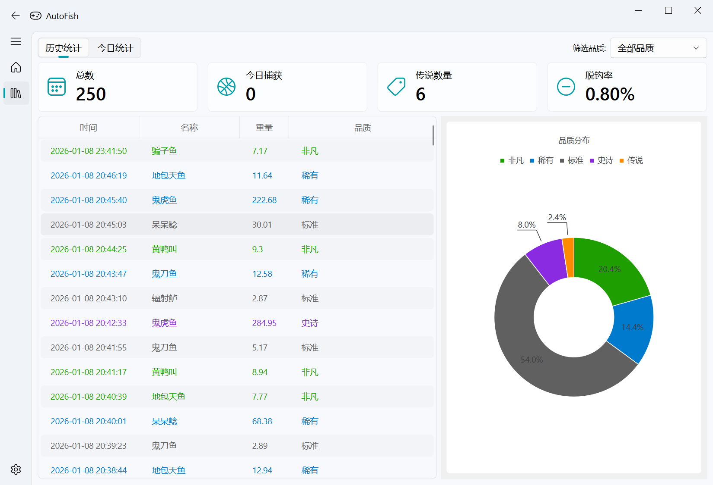
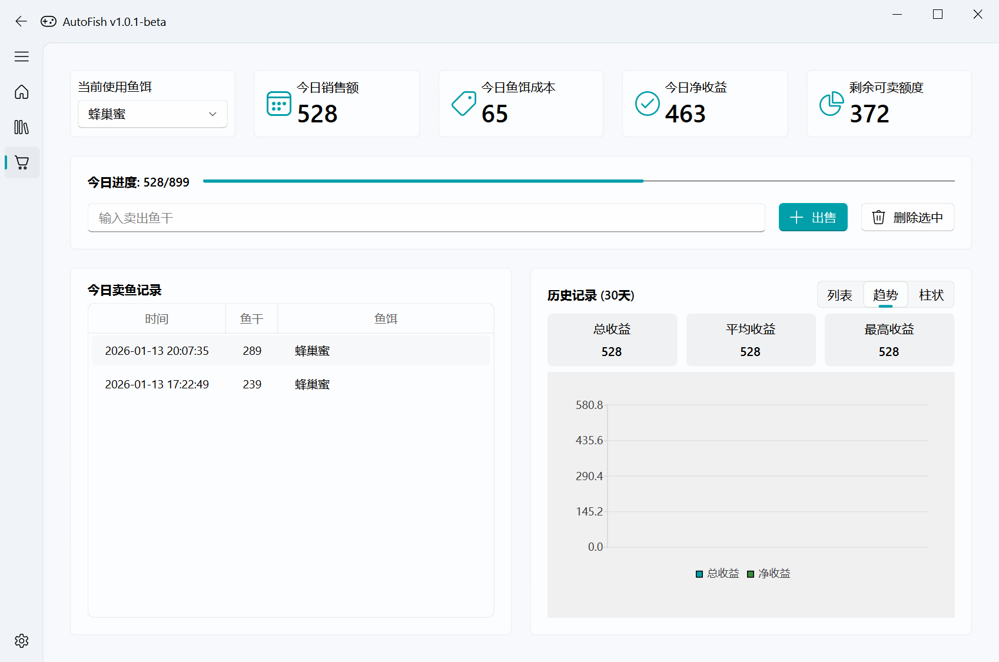

# 🎣 Partyfish - 猛兽派对自动钓鱼助手


**🎮 专为《猛兽派对 (Party Animals)》钓鱼玩法设计的辅助工具**

Partyfish 是一款基于图像识别的钓鱼辅助工具，拥有自动化操作、OCR 钓鱼记录、现代化 GUI 界面等特性，让你在猛兽派对中轻松享受钓鱼乐趣！

---

## 📁 项目结构 (Project Structure)

```
fish/
├── main.py                          # 应用程序入口
├── build.py                         # 构建脚本
├── requirements.txt                 # Python 依赖
├── resources/                       # 资源文件
│   ├── fish.json                    # 鱼类数据库
│   ├── fish/                        # 鱼类图片资源
│   ├── fonts/                       # 字体文件
│   ├── maps/                        # 地图资源
│   ├── location/                    # 位置图片
│   ├── rod/                         # 鱼竿图片
│   ├── weather/                     # 天气图片
│   └── *.png                        # 游戏界面模板图片
├── src/                             # 源代码目录
│   ├── config.py                    # 配置管理
│   ├── vision.py                    # 图像识别模块
│   ├── inputs.py                    # 输入控制
│   ├── workers.py                   # 后台工作线程
│   ├── pokedex.py                   # 鱼类图鉴数据处理
│   ├── pokedex_image_generator.py   # 鱼类图鉴图片生成
│   ├── uno.py                       # uno 游戏摸牌
│   ├── debug_overlay.py             # 调试覆盖层
│   ├── _version.py                  # 版本管理
│   ├── record_manager.py            # 导入导出钓鱼记录
│   ├── configs/                     # 配置模块
│   │   ├── display_config.py        # 显示配置
│   │   ├── game_config.py           # 游戏配置
│   │   └── region_config.py         # 区域配置
│   ├── managers/                    # 管理器模块
│   │   ├── audio_manager.py         # 音频管理
│   │   ├── cycle_reset_manager.py   # 循环重置管理
│   │   ├── sales_limit_manager.py   # 销售限制管理
│   │   └── signal_manager.py        # 信号管理
│   ├── services/                    # 服务模块
│   │   ├── account_service.py       # 账号服务
│   │   ├── chart_builder_service.py # 图表构建服务
│   │   ├── config_manager.py        # 配置管理服务
│   │   ├── coordinate_service.py    # 坐标服务
│   │   ├── data_loader_service.py   # 数据加载服务
│   │   ├── digit_recognition_service.py # 数字识别服务
│   │   ├── fishing_service.py       # 钓鱼服务
│   │   ├── hardware_info.py         # 硬件信息工具
│   │   ├── ocr_service.py           # OCR 服务
│   │   ├── profit_analysis_service.py # 收益分析服务
│   │   ├── record_chart_service.py  # 记录图表服务
│   │   ├── record_data_service.py   # 记录数据服务
│   │   ├── record_service.py        # 记录服务
│   │   ├── record_stats_service.py  # 记录统计服务
│   │   ├── release_service.py       # 发布服务
│   │   ├── screenshot_service.py    # 截图服务
│   │   ├── state_machine.py         # 状态机
│   │   ├── template_service.py      # 模板服务
│   │   ├── vision_utils_service.py  # 视觉工具服务
│   │   └── window_service.py        # 窗口服务
│   ├── gui/                         # GUI 界面模块
│   │   ├── components/              # 可复用组件
│   │   │   ├── draggable_scroll_area.py # 可拖拽滚动区域
│   │   │   ├── filter_drawer.py     # 过滤抽屉
│   │   │   ├── filter_panel.py      # 过滤面板
│   │   │   ├── fish_preview.py      # 鱼类预览
│   │   │   └── home_fish_card.py    # 主页鱼类卡片
│   │   ├── main_window.py           # 主窗口
│   │   ├── home_interface.py        # 主页面
│   │   ├── records_interface.py     # 钓鱼记录
│   │   ├── profit_interface.py      # 收益统计
│   │   ├── pokedex_interface.py     # 鱼类图鉴
│   │   ├── settings_interface.py    # 设置页面
│   │   ├── overlay_window.py        # 迷你悬浮窗
│   │   ├── fish_detail_dialog.py    # 鱼类详情对话框
│   │   ├── sell_confirmation_dialog.py # 售卖确认对话框
│   │   ├── single_instance.py       # 单实例管理
│   │   └── welcome_dialog.py        # 欢迎对话框
├── data/                            # 数据存储（自动生成）
│   ├── audio/                       # 音频资源
│   │   ├── inventory_full.mp3       # 鱼桶满提示音
│   │   ├── no_bait.mp3              # 没鱼饵提示音
│   │   ├── pause.mp3                # 暂停提示音
│   │   ├── start.mp3                # 开始提示音
│   │   ├── 没鱼饵啦！该买鱼饵了.mp3  # 没鱼饵中文提示音
│   │   └── 鱼桶满啦！该卖鱼了.mp3    # 鱼桶满中文提示音
│   ├── protected_fish.json          # 放生配置
│   ├── records.csv                  # 钓鱼记录
│   └── sales.csv                    # 销售记录
└── docs/                            # 文档
    └── images/                      # 图片资源
```

---

## ✨ 核心功能 (Core Features)

### 🤖 全自动钓鱼流程

Partyfish 实现了“一键式”辅助钓鱼。启动后，它会自动执行所有必要的操作：

- **自动抛竿**：精准识别抛竿提示，并模拟按键操作。
- **智能等待**：耐心等待鱼儿上钩的信号。
- **循环收线**：在鱼儿上钩后，自动进行收线操作，直至成功捕获。
  整个过程完全自动化，无需任何人工干预，让您可以轻松挂机，解放双手。

### 🎨 现代化且直观的用户界面

基于 `PySide6` 和 `QFluentWidgets` 为 Partyfish 打造了一个现代化、美观且易于使用的图形用户界面。您可以通过这个界面轻松进行所有设置、查看钓鱼记录和统计数据。

### 📊 智能钓鱼记录与统计

Partyfish 不仅能自动钓鱼，还能通过 OCR 技术精准识别并记录每一条渔获的详细信息，包括鱼的名称、重量、品质和垂钓时间。所有数据都会被整齐地记录下来，方便您随时回顾和分析。

此外，程序内置了数据统计面板，让您对自己的钓鱼成果一目了然。您可以轻松查看总渔获数量、传奇品质鱼类的数量、脱钩率等关键指标，并通过直观的饼图了解不同品质鱼类的分布情况。



### 💰 收益管理与自动卖鱼

Partyfish 新增了强大的收益管理功能，助您成为精明的渔业大亨：

- **快捷键自动卖鱼**：在卖鱼界面按下 `F4`（默认），程序会自动识别鱼桶价值，记录到账，并模拟点击卖出。您可以在设置中开启或关闭自动点击功能。
- **智能净收益统计**：系统会自动记录钓鱼时的鱼饵消耗，并计算每日的净收益。当每日卖鱼额度达到 900 上限后，后续的鱼饵消耗将不再计入当日成本，确保收益计算精准。
- **全方位数据分析**：全新的“收益”界面提供了今日进度条、历史趋势图和柱状图，让您直观地掌握每日盈亏和长期趋势。



### 📸 传奇鱼种自动截图

当您钓到珍贵的“传奇”品质鱼类时，Partyfish 会自动为您截取当前的游戏画面，并将其保存在 `screenshots` 文件夹中。这个功能可以帮助您轻松记录下每一个激动人心的瞬间，并方便地与朋友分享您的战利品。

### 👁️ 可视化调试模式

对于开发者和高级用户，我们提供了可视化调试功能。按快捷键开启此模式后，Partyfish 会在游戏画面上截图展示其图像识别的过程和结果。

您可以清晰地看到程序正在匹配哪些图像、识别的精确区域以及当前的决策状态。这不仅极大地简化了调试过程，也让您能更直观地了解 Partyfish 的工作原理，并根据需要进行调整和优化。


### 🖥️ 迷你悬浮窗

为了让您在享受自动化钓鱼的便利时，仍能随时掌握程序状态，我们设计了简约而不失功能的迷你悬浮窗。

这个悬浮窗会以最不打扰的方式驻留在游戏窗口的边缘，实时显示当前是“工作中”还是“休息中”，以及本次运行的钓鱼次数。您可以随时了解程序动态，而无需切出游戏或打开主界面。


### ⌨️ 全局热键支持

为了提供最便捷的操作体验，Partyfish 支持全局热键：

- **F2**：随时启动或暂停自动钓鱼，无需切换窗口。
- **F10**：立即截取当前游戏画面并保存到 `debug_screenshots` 文件夹，方便您在遇到问题时进行排查和反馈。

---

## 🚀 快速开始 (Quick Start)

### 📥 下载安装

从以下渠道下载最新版本的 PartyFish：

| 版本              | 下载链接                                                | 提取码 |
| ----------------- | ------------------------------------------------------- | ------ |
| **v2.0** (旧版本) | [🔗 蓝奏云下载](https://wwaqq.lanzouu.com/b0187zi2xg)   | `fish` |
| **v2.4** (最新)   | [🔗 蓝奏云下载](https://wwasj.lanzouu.com/imv423ec6inc) | `fish` |
| 查看所有版本      | [🔗蓝奏云 页面](https://wwasj.lanzouu.com/b00181gfve)   | `fish` |

### 📂 安装步骤

1. **下载** - 从上方链接下载压缩包
2. **解压** - 将压缩包解压到任意目录
3. **运行** - 双击运行 `PartyFish.exe`

就是这么简单！🎉

---

## 📖 使用方法 (Usage)

- **启动/暂停**：按下 `F2` 键启动或暂停自动钓鱼。
- **调试截图**：按下 `F10` 键可截取当前游戏画面，用于问题排查和调试。
- **配置**：在程序主界面，您可以根据游戏内的分辨率和设置调整相关参数，以获得最佳识别效果。

---

## 🔧 工作原理 (How it Works)

Partyfish 的核心是利用 **OpenCV** 进行图像识别和模板匹配。它会持续分析游戏画面，识别出抛竿提示、咬钩信号和渔获信息等关键图像。当需要记录钓鱼数据时，程序会调用 **RapidOCR** 引擎，对截图中的文字（鱼的名称、重量、品质）进行识别，并将结果保存到本地记录中。

---

## 💾 数据与截图 (Data & Screenshots)

- **钓鱼记录**：所有的钓鱼数据都以 CSV 格式保存在程序目录下的 `data/records.csv` 文件中。您可以使用 Excel 或其他表格软件打开和分析。
- **传奇截图**：钓到“传奇”品质鱼类的截图会自动保存在 `screenshots` 文件夹中。
- **调试截图**：通过 `F10` 热键截取的调试图片会保存在 `debug_screenshots` 文件夹中。

---

## 🚀 未来计划 (Future Plans)

- **[ ] 窗口化模式支持**：目前仅支持全屏/无边框窗口模式，未来将通过窗口句柄识别等技术，实现对窗口化运行模式的支持。
- **[ ] 手动钓鱼记录模式**：允许用户在手动钓鱼时，程序也能自动识别并记录渔获信息，满足不同玩家的需求。
- **[x] 半自动售出记录**：增加一个新功能，通过识别商店界面的售出确认信息，帮助用户记录当天已售出鱼的总鱼干，方便进行收益统计。

---

## 📝 许可证

本项目采用 [Apache License 2.0](LICENSE) 许可证。

---

## 👤 开发者

**FadedTUMI** - [GitHub](https://github.com/FADEDTUMI)
**MaiDong** - [GitHub](https://github.com/MaiDong)
**Pei-xiao-xiao** - [GitHub](https://github.com/Pei-xiao-xiao)

---

## 🚀 项目重生公告

<div align="center">

⭐ 如果这个项目对你有帮助，请给一个 Star！

**[📥 下载 PartyFish](https://github.com/FADEDTUMI/PartyFish/releases/latest)**

</div>
